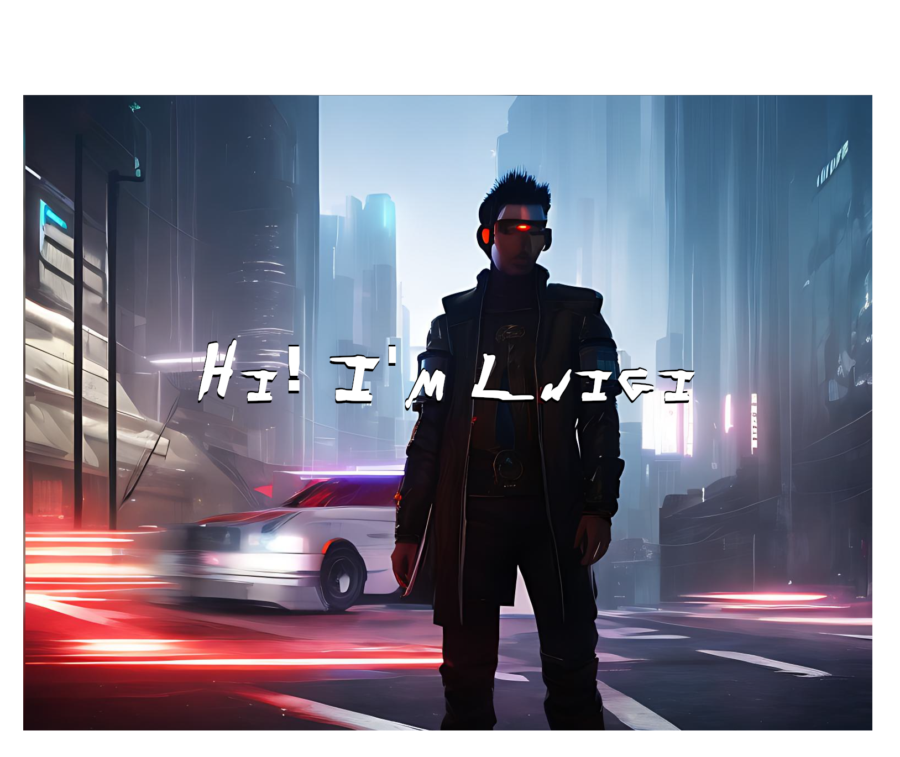

I am an italian boy who has been coding for about six years 
I studied many languages such as: Python (my fav), Scala, Dart or Java and framework/libraries such as: Django, Flutter, FastAPI, Flask. 
YEP, I like to change! 

I love reading, workout, hanging out with friends and i love tasting whisky.

<h2>My skills</h2>
  

  

)

<h2>My GitHub Stats</h2>

  

  

<!--
**Federica129/Federica129** is a ✨ _special_ ✨ repository because its `README.md` (this file) appears on your GitHub profile.
icons : https://github.com/Ileriayo/markdown-badges
stats : https://github.com/anuraghazra/github-readme-stats
-->
<!--
**LuigiSavino/LuigiSavino** is a ✨ _special_ ✨ repository because its `README.md` (this file) appears on your GitHub profile.

Here are some ideas to get you started:

- 🔭 I’m currently working on ...
- 🌱 I’m currently learning ...
- 👯 I’m looking to collaborate on ...
- 🤔 I’m looking for help with ...
- 💬 Ask me about ...
- 📫 How to reach me: ...
- 😄 Pronouns: ...
- ⚡ Fun fact: ...
-->
